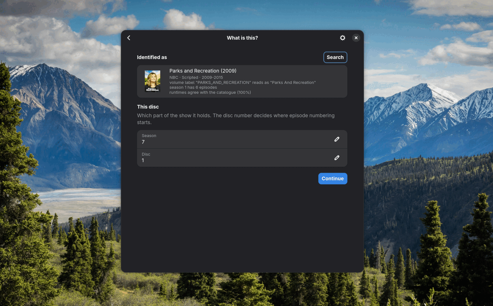

<div align="center">


# Riplika

**Reads a disc and writes library files, named and tagged.**

</div>



Riplika takes the tedious and technical parts out of backing up a media library. You should not need an opinion about codecs or subtitle formats to get a disc onto your own server.

It asks the drive what it is holding and runs the pipeline that suits it.

| | Produces | Named from |
|---|---|---|
| **DVD** | Encoded video, subtitles as text | TMDB, TVmaze or Wikidata, checked against the disc's own structure |
| **Music CD** | FLAC or MP3, tagged, with cover art | MusicBrainz, or the disc's CD-Text |
| **Game disc** | A raw image, or a cue sheet and one file per track | Redump datfiles, matched on what it hashes to |

## What it does

DVD subtitles arrive as pictures, and Riplika matches those bitmaps against a table of known letters, which gives 99% character accuracy and cue timings taken from the source. That is the most unusual part of the project and [has its own document](docs/subtitles.md).

A volume label is a hypothesis, so the shape of the disc is read as evidence beside it. A "play all" title decomposes into which titles are episodes and what order they run in, and a disc holding one long title is read as a film. Runtimes are checked against whatever the catalogue answered, and the reasoning is shown to you before anything is read.

A game dump is verified while it is made, against the drive's C2 error pointers for audio and against the error detection inside the sectors themselves for data. A bad read can then be told from a disc nobody has catalogued, and a dump that nearly matches names the disc it came closest to, along with the tracks that disagreed.

Crop and inverse telecine are measured from the video. Quality has three settings and everything else follows from the disc, which is a deliberate limit, since anyone who wants to tune an encode is better served by the tools that already do that.

The window and the command line do the same things.

## Install

The Flatpak carries everything it needs:

```sh
flatpak-builder --user --install --force-clean build packaging/com.nsrosenqvist.Riplika.yml
```

For a native build you need ffmpeg and cdparanoia:

```sh
sudo pacman -S ffmpeg libdvdcss libdvdread libdvdnav cdparanoia
cargo build --release
```

```sh
riplika drives                          # what is connected, and what is in it
riplika rip --season 6 --disc 1         # the whole pipeline
riplika rip-cd --format flac
riplika rip-game
riplika-gui                             # or the window
```

`--dry-run` prints what would be produced and stops without reading anything.

## Documentation

| | |
|---|---|
| [Reading a disc](docs/discs.md) | which software reads it, damaged discs, packaging, hardware notes |
| [Working out what a disc is](docs/identifying.md) | catalogues, episode mapping, what to take |
| [Encoding](docs/transcoding.md) | quality tiers and the decisions behind them |
| [Subtitles](docs/subtitles.md) | deterministic recognition, and how well it works |
| [Configuration](docs/configuration.md) | where things live, preferences |
| [AGENTS.md](AGENTS.md) | architecture, for anyone changing the code |

## Status

Riplika works and is in use. The subtitle recogniser has been measured over 122 episodes, and disc handling has been run against real discs including damaged ones. A PC CD-ROM matched Redump byte for byte, and a scratched PlayStation disc was caught by its own C2 flags before it could pass as a good dump.

Blu-ray has never been tested against a disc. Where MakeMKV is installed it is used as a fallback for a disc the free reader cannot manage, though it cannot be bundled in the Flatpak.

## Licence

Riplika is MIT licensed; see [LICENSE](LICENSE).
